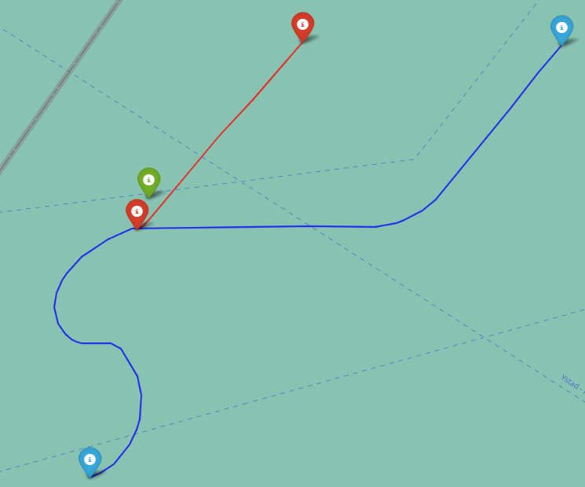

# Exam assignment - finding the closest moving vessels at sea

## The answer
The closest moving sea vessels in the given area in the date range of December 1, 2021, to December 31, 2021 were the KARIN HOEJ (MMSI 219021240) and MV SCOT CARRIER (MMSI 232018267), which collided on December 13th. 

Below is a screenshot from the HTML map of the trajectories 20 minutes around the collision moment. The interactive plot can be viewed by clicking upon the image.

## The process of getting the potential shortest distances
1. Reading in csv files row by row: a simple approach was chosen, processing csv files a row at a time. 
2. Coarse grain filtering: as the row is read, course grain filtering is applied first, based on the bounding box around the circle. This helps avoid unnecessary computations for rows which would not be relevant. An additional filter requiring that the vessel's navigational status is "Underway using engine", indicating that the vessel is moving.
3. Fine grain filtering: provided that the row passes the coarse filters, an equirectangular approximation formula is applied to check whether the vessel is actually within the radius of the circle coordinate.
4. Distances between vessels: a nested loop iterates over the vessel positions, computing the distance between the every vessel, and all other vessels. Vessels are paired based on their MMSIs, and their distances are stored in a dictionary, with the MMSIs as the key. If a pair of vessels already exists in the dictionary, the entry is only updated if the new distance is smaller than the previous one. If the vessel is no longer within the specified radius, its latest position is removed from the dictionary.
5. Trimming and logging: the results are logged periodically, and trimmed to a number of maximum smallest distance encounters allowed. The larger the value of maximum encounters stored, the more computationally expensive the calculations, as every new pair would be compared with more vessels.
6. Parallelisation: the process is parallelised based on the fact that every encounter also needs to have happened at a similar point in time. Thus, it would not be beneficial to compare vessel positions from different days. However, this also came with a risk - if the encounter were to have happened around exactly midnight, it would have been missed. However, given my assumption of the vessel timestamps having to be no more than 1 minute of each other to be considered, this would have been highly unlikely. The pool of worker processes each file across multiple CPU cores, leading to a big improvement in execution time. 

Thanks to the coarse grain filtering, a more efficient distance calculation formula, and parallelisation, the final time it took to get the 310 potential vessel pairs was a little over 17 minutes.

## Noise filtering and result confirmation
With my condition of vessel timestamps having to be no more than 1 minute of each other to be considered, 4 out of 310 vessel pairs were left. The first pair had the problem of the same vessel being recorded in two locations at the same time, allowing me to exclude that result as noise. The second pair the KARIN HOEJ (MMSI 219021240) and MV SCOT CARRIER (MMSI 232018267), which actually collided on December 13th of 2021. 